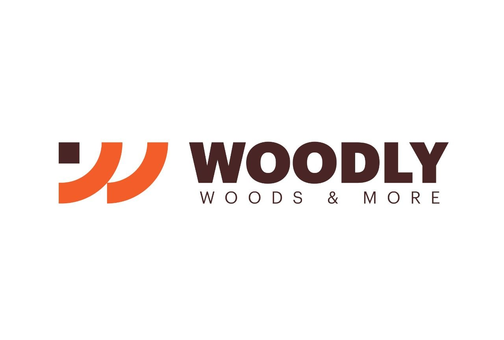

# WOODLY — Egypt's First Wood Marketplace

A modern, responsive landing page for WOODLY, built with **Next.js 15**, **TypeScript**, and **Tailwind CSS v4**.



## Tech Stack

- **Framework**: Next.js 15 (App Router)
- **Language**: TypeScript
- **Styling**: Tailwind CSS v4
- **Fonts**: Bebas Neue + DM Sans (Google Fonts)
- **Animations**: CSS animations with Intersection Observer for scroll triggers

## Features

- Fully responsive (mobile → desktop)
- Scroll-triggered entrance animations
- Auto-rotating testimonial carousel
- Interactive "Add to Cart" button states
- Sticky navbar with scroll-aware transparency
- Mobile hamburger menu
- Brand pattern SVG as decorative backgrounds
- Bilingual support (English + Arabic subtitle)
- SEO metadata configured

## Getting Started

```bash
# Install dependencies
npm install

# Start development server
npm run dev

# Build for production
npm run build

# Start production server
npm start
```

Open [http://localhost:3000](http://localhost:3000) to view the site.

## Project Structure

```
src/
├── app/
│   ├── globals.css      # Tailwind + custom tokens + animations
│   ├── layout.tsx       # Root layout with fonts & metadata
│   └── page.tsx         # Landing page composition
├── components/
│   ├── Navbar.tsx       # Sticky nav with mobile menu
│   ├── Hero.tsx         # Full-screen hero with CTAs
│   ├── Suppliers.tsx    # Marquee supplier cards
│   ├── ValueProps.tsx   # "Why WOODLY" 4-card grid
│   ├── Categories.tsx   # Category image cards
│   ├── FeaturedProducts.tsx  # Product grid with cart interaction
│   ├── Testimonials.tsx      # Auto-rotating carousel
│   ├── CTABanner.tsx         # Call-to-action banner
│   └── Footer.tsx            # Full footer with columns
└── lib/
    ├── data.ts          # All static content/data
    └── useInView.ts     # Intersection Observer hook
```

## Brand Colors

| Token       | Hex       |
|-------------|-----------|
| Brown 800   | `#3B2314` |
| Orange 500  | `#E8762A` |
| Cream 200   | `#F5EDE4` |
| Cream 100   | `#FAF6F1` |

## Deploy

This project is ready for deployment on **Vercel**:

[](https://vercel.com/new)

## License

Private — WOODLY brand assets are proprietary.
